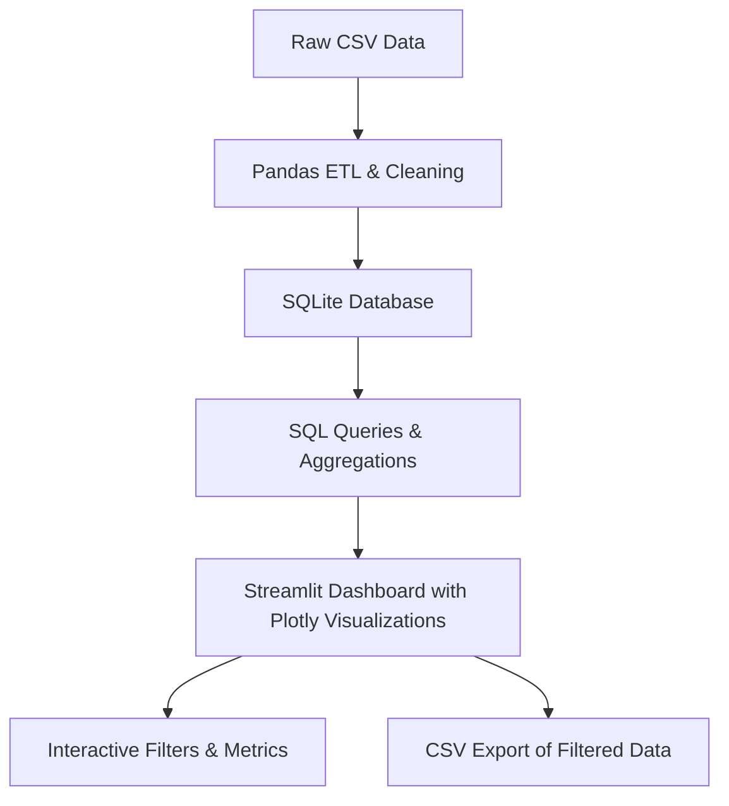

# HR Analytics Dashboard

An interactive, modular data dashboard for analyzing HR job change data. This project covers the full pipeline from data preparation and storage to dynamic visualizations with advanced user filtering.


---

## Project Objectives

- Modular ETL and visualization codebase
- Data cleaning and transformation using Pandas
- Data storage and querying with SQLite
- Interactive charts with Plotly and Streamlit
- Multi-dimensional filters for dynamic data exploration
- CSV export of filtered data directly from the app

---

## Tech Stack

| Layer               | Tools Used                      |
|---------------------|--------------------------------|
| Programming Language | Python                         |
| Data Processing     | Pandas                        |
| Database            | SQLite                       |
| Query Language      | SQL                          |
| Visualization       | Streamlit, Plotly             |
| UI/UX Styling       | Custom CSS in Streamlit Markdown |

---

## Architecture and Workflow



## Application Features

- Multi-dimensional filtering by demographics (gender, education) and business attributes (company type, experience)
- KPIs dynamically updating based on filters
- Multiple interactive visual analysis views including:
  - Average training hours by city and education level
  - Job change rates by experience and education (MSc/PhD focus)
  - Top cities by candidate count
  - Company type distribution and job change propensity
  - Exploratory data analysis with histograms and distribution plots
- Responsive UI with animated header and customized sidebar
- Download filtered datasets as CSV possible for offline analysis

## How to Run

1. Ensure `job_data.db` is present with the cleaned data.  
2. Install dependencies listed in `requirements.txt` (streamlit, pandas, plotly, sqlite3, etc.)  
3. Run the app with:  
   ```bash
   streamlit run app.py
   ```
4. Use the sidebar filters and analysis selector to explore data interactively.
